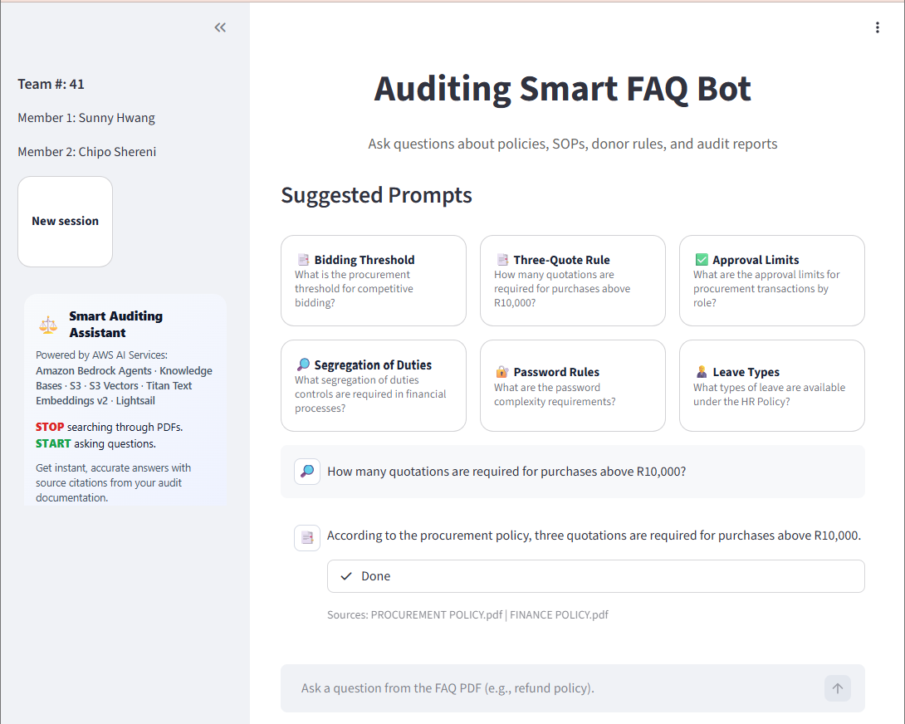

# Auditing Smart FAQ Bot

**RAG-based Audit & Compliance Assistant powered by Amazon Bedrock**

---

## 👩‍💻 Team

**Team 41 – AWS ANZ Diversity Hackathon (Feb 2026)**

- **Sunny Hwang**
- **Chipo Shereni**

---

## 🌐 Live Application

The application is publicly accessible at:

**http://54.90.193.128:8501/**

The system is deployed on Amazon Lightsail (Ubuntu 22.04) and runs a production-configured Streamlit application integrated with Amazon Bedrock Agents and Knowledge Base services.

> Note: This environment is configured for demonstration purposes.

---

## 📸 Application Preview

## 

The interface allows auditors to submit natural language queries and receive citation-backed responses grounded in internal documents.

## 📌 Overview

The **Auditing Smart FAQ Bot** is a Retrieval-Augmented Generation (RAG) system designed to support internal and external auditors in accessing policy documents, SOPs, donor rules, and audit reports through a conversational interface.

Instead of manually searching across fragmented PDF documents and folders, auditors can ask natural language questions and receive grounded, citation-backed responses sourced from approved internal documents.

---

## 🎯 Problem Statement

Auditors frequently spend significant time:

- Searching across scattered PDFs and policy repositories
- Verifying the latest versions of compliance documents
- Consulting senior staff for recurring policy clarifications
- Interpreting donor rules and regulatory requirements

This leads to inefficiency, inconsistent interpretation, and increased audit risk.

---

## 🧠 Solution

The system provides:

- Natural language Q&A over audit documents
- Retrieval-Augmented Generation (RAG) architecture
- Citation-backed answers using Bedrock Agent trace events
- Secure and scalable cloud-based deployment

---

## 🏗 Architecture

### Core Components

- **Amazon Lightsail (Ubuntu 22.04)** – Hosts the deployed Streamlit application
- **Streamlit Web Application** – Chat interface and Bedrock Agent invocation
- **Amazon S3** – Secure document storage and vector indexing
- **Amazon Bedrock Knowledge Base** – Chunking, embedding (Titan Text Embeddings v2), semantic retrieval
- **Amazon Bedrock Agent** – RAG orchestration and response generation (Claude 3.5 Sonnet)
- **Claude 3.5 Sonnet** – Foundation model for reasoning and grounded answers

---

## 🔄 System Flow

1. Documents are uploaded to Amazon S3.
2. Knowledge Base indexes and embeds the documents.
3. User submits a question via Streamlit.
4. Bedrock Agent performs RAG retrieval.
5. Claude 3.5 Sonnet generates a grounded response.
6. Trace events return citation data.
7. Answer and sources are displayed in the UI.

---

## 🔐 Security

- IAM role-based access
- No hardcoded credentials
- Trace-based citation defensibility
- Designed for compliance environments

---

## 📊 Business Impact

- Reduces time spent searching for policy documents
- Improves audit consistency and defensibility
- Captures institutional knowledge in a centralized Knowledge Base
- Supports both internal and external auditors

---

## 📄 License

This project was developed for hackathon demonstration purposes.
